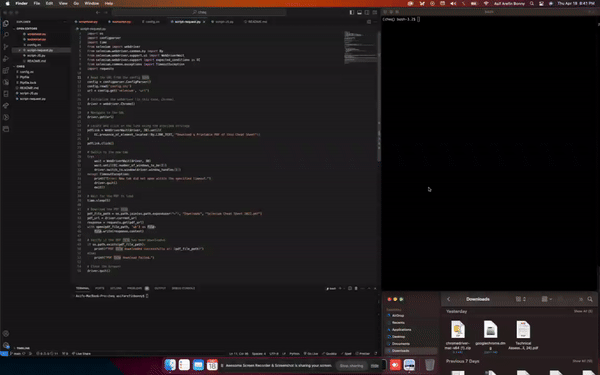

# CHEQ - Assessment

An automation test script that downloads pdf file from a website and stores in local system.

## #Table of Contents

- [Overview](#overview)
- [Prerequisites](#prerequisites)
- [Setting up the environment](#setting-up-the-environment)
- [Description of the project](#description-of-the-project)
- [Screendump](#screendump)
- [Conclusion](#conclusion)

## #Overview

The main challenge here was to avoid using ChromeOptions, FirefoxOptions and Keyboard shortcuts - KeyEvents.
I've investigated and found some other possible ways to do that and some of the ways are:

1. Utilizing the requests library
2. Using the execute_script method of Selenium
3. Employing the urllib module
4. Integrating with a headless browser

But I could only successfully make the script with Utilizing the requests library & Using the execute_script method of Selenium.

1. The script with Utilizing the requests library: ([script-request.py](https://github.com/AsifArefinBonny/cheq/blob/main/script-request.py))
2. The script using the execute_script method of Selenium: ([script-JS.py](https://github.com/AsifArefinBonny/cheq/blob/main/script-JS.py))

And another instruction was not o use any GUI based tool. So I used selenium with python.

## #Prerequisites

- Chrome browser version is: Version 124.0.6367.62 (Official Build) (x86_64)
- I developed and tested the script in Mac OS but this should work in Windows OS as well. (Pipenv is a Python virtualenv management tool that supports a multitude of systems)
- pip (package installer for Python)

## #Setting up the environment

I used virtual environment and to setting up the virtual environment the below-mentioned commands needs to be run:

1. `pip3 install pipenv`
2. `pipenv shell` (It should launch a virtual environment & create a Pipfile)
3. `pipenv install selenium` (It'll create Pipfile.lock)
4. `python script-request.py` (The browser should open with the URL and should start executing the script automatically)

## #Description of the project

- ## **_Script implemented with utilizing the requests library_**

1. **Reading the URL from the config file**:

   - The script starts by reading the URL of the webpage from a configuration file named `config.ini`. This allows the URL to be stored separately and easily modified if needed.

2. **Navigating to the webpage**:

   - The script initializes the Selenium webdriver (in this case, Chrome) and navigates to the URL retrieved from the config file.

3. **Locating and clicking the PDF download link**:

   - The script uses the Selenium `WebDriverWait` and `ExpectedConditions` to locate the link with the text "Download a Printable PDF of this Cheat Sheet". Once the link is found, it is clicked.

4. **Switching to the new tab**:

   - After clicking the link, the script checks if a new tab has opened (using `WebDriverWait` and `ExpectedConditions`) and switches to the new tab.

5. **Waiting for the PDF to load**:

   - The script waits for 5 seconds to allow the PDF file to fully load in the new tab.

6. **Downloading the PDF file**:

   - Instead of using Selenium's methods to trigger the PDF download, the script uses the `requests` library to directly download the PDF content from the current URL (which should be the PDF URL).
   - The script constructs the local file path for the downloaded PDF file (in the user's Downloads directory) and uses the `requests.get()` function to retrieve the PDF content.
   - The retrieved content is then written to the local file using a `with` block.

7. **Verifying the PDF download**:

   - After the download, the script checks if the PDF file exists in the expected location (the user's Downloads directory) to verify that the download was successful.
   - If the file exists, it prints a success message with the file path. If the file is not found, it prints a failure message.

8. **Closing the browser**:
   - Finally, the script closes the Selenium webdriver.

- ## **_Script implemented using the execute_script method of Selenium:_**

1. **Reading the URL from the config file**:
   The script starts by reading the URL of the webpage from a configuration file named `config.ini`. This allows the URL to be stored separately and easily modified if needed.

2. **Navigating to the webpage**:
   The script initializes the Selenium webdriver (in this case, Chrome) and navigates to the URL retrieved from the config file.

3. **Locating and clicking the PDF download link**:
   The script uses the Selenium `WebDriverWait` and `ExpectedConditions` to locate the link with the text "Download a Printable PDF of this Cheat Sheet". Once the link is found, it is clicked.

4. **Switching to the new tab**:
   After clicking the link, the script checks if a new tab has opened (using `WebDriverWait` and `ExpectedConditions`) and switches to the new tab.

5. **Waiting for the PDF to load**:
   The script waits for 5 seconds to allow the PDF file to fully load in the new tab.

6. **Downloading the PDF file**:
   Instead of using Selenium's methods to trigger the PDF download, the script uses the `execute_script` method to download the PDF file. It creates a temporary download link in the DOM, sets the `download` attribute and `href` of the link to the current URL (which should be the PDF URL), clicks the link, and then removes the link from the DOM.
   The `execute_script` method is used to run this JavaScript code, which triggers the PDF download.

7. **Verifying the PDF download**:
   After the download, the script checks if the PDF file exists in the expected location (the user's Downloads directory) to verify that the download was successful.
   If the file exists, it prints a success message with the file path. If the file is not found, it prints a failure message.

8. **Closing the browser**:
   Finally, the script closes the Selenium webdriver.

**The key aspects of these scripts that follow the provided guidelines are:**

1. It does not use `ChromeOptions`, `FirefoxOptions`, or `KeyboardShortcuts - KeyEvents` to handle the PDF download, as specified in the instructions.
2. This script demonstrates a programmatic approach to automating the PDF download process and not a GUI based tool following the guidelines provided in the instructions.

## #Screendump

Video file is here ([screendump.mp4](https://github.com/AsifArefinBonny/cheq/blob/main/screendump.mp4))

## #Conclusion

It was a nice challenge. I really enjoyed and learned a lot of thing doing this. Thanks :)
